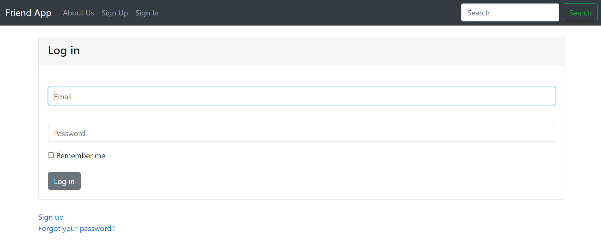
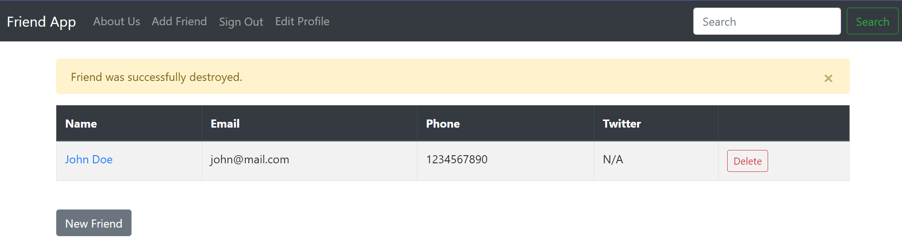
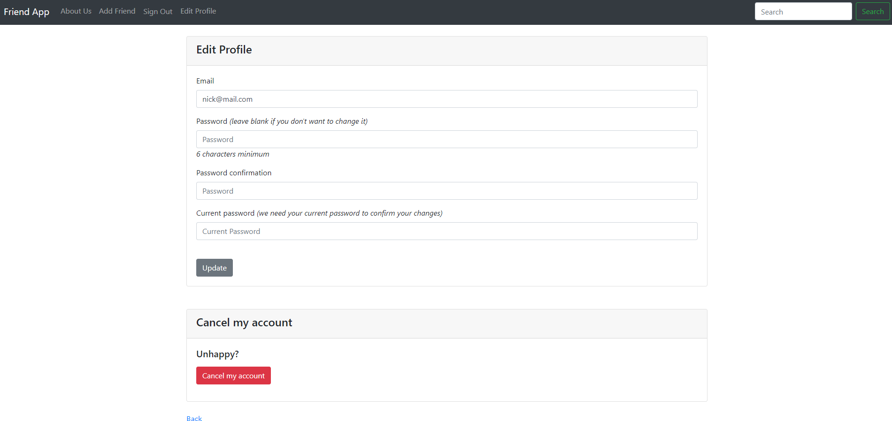

# <h1 align="center">Ruby Friends</h1>

 
  
 

## 📝 Description

Welcome to Ruby Friends! This is a simple Full Stack Web Application created using Ruby on Rails and Ruby. Using full CRUD, users can sign in and manage their friends list. This project was created to learn Ruby on Rails and it's basic set up.

## 🖼️ Screenshots

 
 📊 App Web Pages

 
 | Description | Screenshot |
 |------------ | ------------|
 | <h3 align="center">Login Page</h3> | 
 | <h3 align="center">Friends List</h3> | 
 | <h3 align="center">Edit Profile</h3> | 

 

## 💻 Technologies Used

## ⚛️ Getting Started

### 📲 Instructions

How to Navigate the App

1. Login or sign up with an email and password.

2. After being redirected to the Friends List page, click the Add Friend button to add a friend with their information.

3. Each friend can be editted and deleted.

4. The Navbar allows a user to edit their profile and remove it from the database.

### 🔗 Links

Comning soon...

## ⏭️ Next Steps

- [ ] Find and fix possible bugs
- [ ] Refactor code